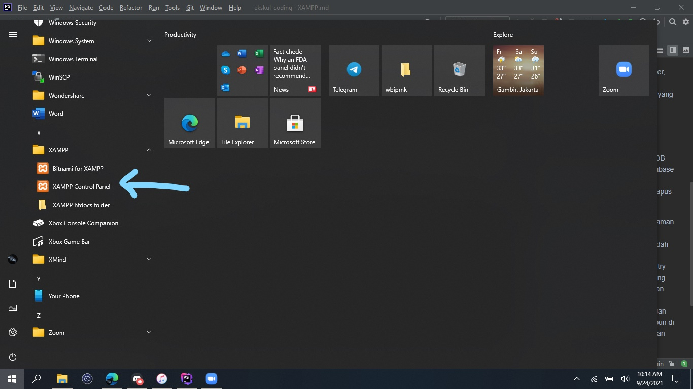
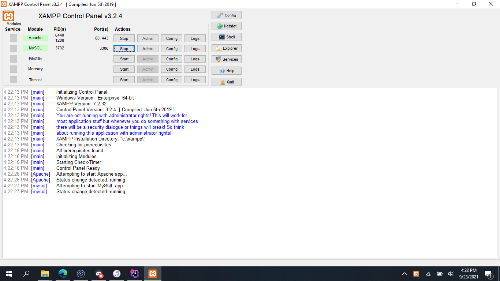
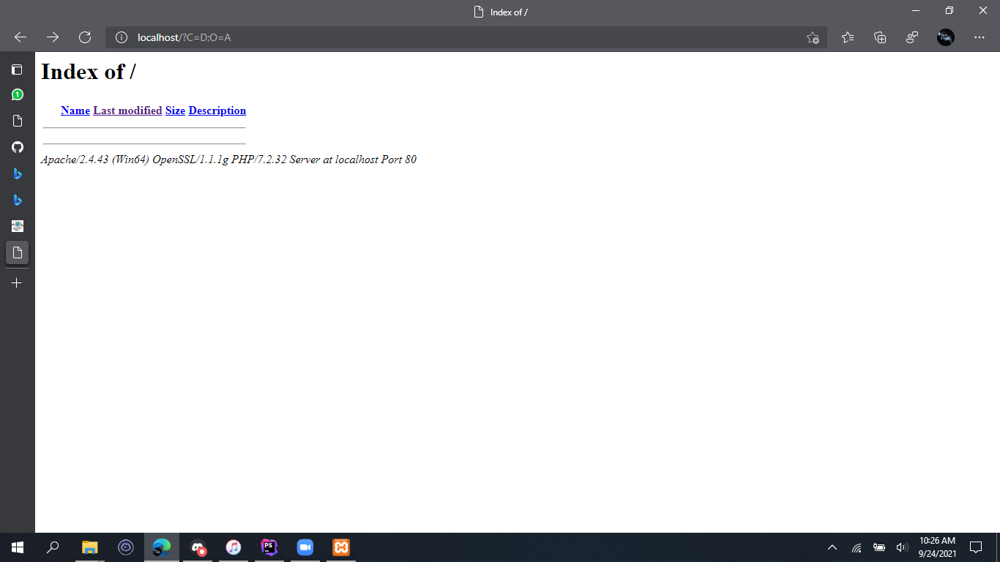

<h1 align="center">XAMPP Modules</h1>

penjelasan tentang apa itu XAMPP dan manual book XAMPP

  
<h3 align="left">Apa sih XAMPP Itu ?</h3>

Hai, Selamat Datang di Modules Kedua Ekskul SMP Muhammadiyah Program Khusus Surakarta! Kalian Sudah berhasil mendownload XAMPP kan ? Nah Mari cari tau tentang XAMPP, Apa sih XAMPP Itu?

XAMPP punya Singkatan lho ! Yuk simak singkatan XAMPP ini

- X = Cross Platform, Maksud dari Cross platform disini adalah XAMPP bisa digunakan di semua platform kalian, Kalian bisa menggunakan Windows, MACOSX, Linux, Redhat, Dsb.

- A = Apache. Adalah Software yang bisa kalian gunakan untuk membuat Webserver, Pengertian Web Server adalah suatu perangkat lunak (software) dalam server yang berfungsi untuk menerima permintaan (request) dari client atau browser berupa halaman website melalui protokol HTTP/ HTTPS

- M = MySQL / MariaDB. MySQL / MariaDB adalah software untuk management Database SQL untuk Website kalian, kalian bisa membuat, mengedit, mengimpor, menghapus Database dari MySQL

- p = PHP. PHP Adalah Bahasa Pemrograman yang kerap kita gunakan di development website. Kelebihan PHP adalah PHP mudah di install dan dikonfigurasi. membuatnya menjadi bahasa pemrograman tingkat entry level yang mudah dipelajari bagi seseorang yang baru memulai belajar pengembangan web. Tutorial untuk memulai belajar pemrograman PHP dapat diperoleh dengan mudah secara online, di toko buku, ataupun di lembaga bimbingan kursus pengembangan website.

- P = Perl. Perl adalah bahasa pemrograman yang bisa kita gunakan untuk membantu kinerja dari bahasa pemrograman PHP. 

  
<h3 align="left">Bagaimana cara Menggunakan XAMPP ?</h3>

Klik pada windows kalian, Lalu carilah Aplikasi ini

lalu setelah itu klik pada 2 tombol yang ada di gambar bawah ini (Jika kalian tidak bisa membuka gambar ,klik Start Apache Dan Start MySQL)

Jika kalian sudah menyalakan kedua hal tersebut coba cek di <a href="http://localhost">http://localhost</a> apakah kalian sudah melihat pada gamber seperti ini atau belum

apabila kalian sudah melihat / berhasil masuk ke localhost..selamat kamu sudah berhasil instalasi XAMPPM, jika belum silahkan troubleshoot dengan guru atau Whatasapp Writer Untuk mendapat bantuan :D

