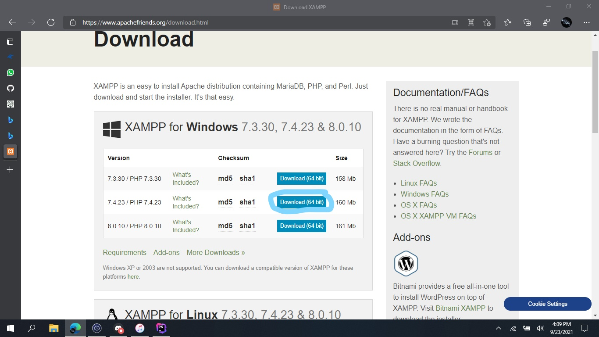

<h1 align="center">Requirement</h1>
<h3 align="center">Selamat datang di pertemuan pertama Ekskul Coding Para Programers SMP Muhammadiyah Program Khusus Surakarta!</h3>
  
<h3 align="left">Kebutuhan Wajib :</h3>

Yang kalian butuhkan adalah :

- XAMPP

- Code Editor

- GitHub Account (Optional)

- Computer :V

- More

  
<h3 align="left">Persyaratan  :</h3>

Yang kalian harus kalian penuhi adalah :

- Windows 7+

- RAM 2GB+

- Disk 3GB+

- Administrator Access

  
<h3 align="left">Tutorial Cara Instalasi Dan Penggunaan XAMPP :</h3>

Apa Sih XAMPP itu ? XAMPP adalah sebuah paket perangkat lunak (software) komputer yang sistem penamaannya diambil dari akronim kata Apache, MySQL (dulu) / MariaDB (sekarang), PHP, dan Perl.

pertama pergi kelaman ini : <a href="https://www.apachefriends.org/download.html">https://www.apachefriends.org/download.html</a>

Kedua Pilih Download Yang ada di gambar Dibawah ini :

setelah kalian mendownloadnya silahkan run installernya, lakukan next, next, next saja! setelah itu kalian akan melihat di bagian windows kalian sudah terinstall XAMPP, Jika sudah berhasil, Selamat kamu sudah berhasil mendownload XAMPP :D

  
<h2 align="center">Code Editor</h2>

apa itu Code Editor ? Code Editor adalah sebuah Tools untuk menulis sebuah kode yang bertujuan untuk membuat Software, banyak pilihan Software code editor, salah satunya adalah Visual Studio Code, Sublime Text, Atom, Dsb!

Pilihan Code Editor :

- Sublime Text : https://www.sublimetext.com/download (Writer Recommendation)

- Visual Studio Code : https://code.visualstudio.com/Download

Atom By GitHub : https://atom.io/

Intellij IDEA Community Edition : https://www.jetbrains.com/idea/download/download-thanks.html?platform=windows&code=IIC

Kite : https://www.kite.com/

Dan sebagainya (Ingin menambahkan list Code Editor ? Fork Repo ini dan writer akan melakukan merge)

